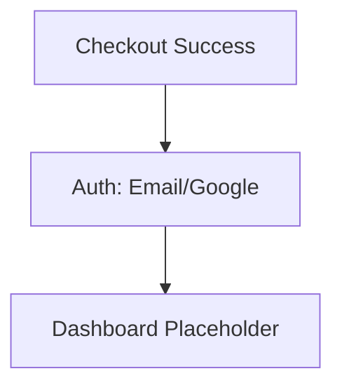
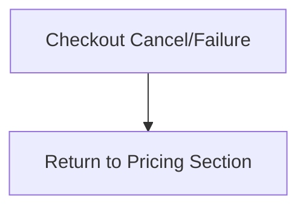
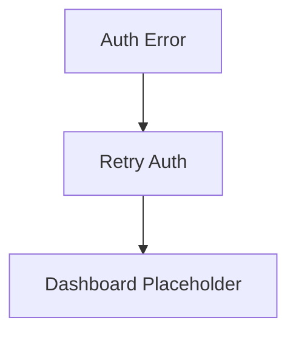

# autopilotreels UX Design Specification

_Created on 2026-02-03 by darko_
_Generated using BMad Method - Create UX Design Workflow v1.0_

---

## Executive Summary

**Project:** autopilotreels — a payment-first demand-validation MVP for an AI short-form video SaaS idea. The MVP focuses on a pixel-close, trust-building landing experience that drives users directly into Stripe checkout before signup, followed by post-payment auth and a placeholder dashboard. The goal is to validate conversion, pricing, and willingness to pay without building AI video capabilities.

**Target Users:** Prospective buyers interested in AI short-form video automation (likely creators, marketers, or small teams), visiting from paid/organic traffic who should feel immediate trust and be willing to pay before account creation. The experience prioritizes frictionless checkout and clear expectations about limited availability.

**Platform:** Web (responsive).

**UX Complexity:** Low (single primary user journey, simple linear funnel, and minimal interaction depth).

**Reference Clone Target:** facelessreels.com (pixel-close structure, hierarchy, and visual rhythm).

**Implementation Source of Truth:** `frontend/` (Next.js + Tailwind). This specification is updated to match the built UI and routes.

**Inspiration Analysis (Reference: facelessreels.com):**

- Above-the-fold hero with a bold outcome headline (“Create viral faceless videos on auto‑pilot”), a clear primary CTA (“Create your first video”), and a large “Trusted by 353k+ users” credibility marker.
- Subheadline promise: “The only AI that generates & posts videos for you automatically, even while you sleep.”
- Immediate sub‑CTA promise: “Get your generated video in less than 5 minutes.”
- “Perfect for” / niche list that scrolls through categories (e.g., scary stories, history, true crime) to quickly show breadth.
- “Creates videos for any niche” grid that repeats the breadth message in a structured list.
- “We actually get views” proof section with channel performance screenshots and metrics.
- “Why creators choose us” comparison block (hiring editors vs DIY vs FacelessReels).
- Large testimonial grid with repeated short quotes to reinforce social proof.
- “How it works” in 3 steps (Create a Series → Customize → Watch your socials grow).
- “See it in action” demo video section.
- FAQ section covering common objections.
- Simple top navigation and straightforward footer with product/company/legal links.

---

## 1. Design System Foundation

### 1.1 Design System Choice

**Choice:** Tailwind CSS + custom React components (as implemented in `frontend/`).

**Rationale:** The live UI is built as bespoke components using Tailwind classes rather than a component library.

**Provides:** Utility-first styling, responsive layout control, and custom component composition.

---

## 2. Core User Experience

### 2.1 Defining Experience

**Defining Experience:** A pixel‑close web landing page that mirrors the reference site’s structure and visual rhythm to build immediate trust, then drives users straight into a payment‑first Stripe checkout before any account creation.

**One‑Sentence Definition:** “It’s the pixel‑perfect landing page clone that builds instant trust and gets you to a payment‑first checkout in seconds.”

**Absolutely Effortless:** Scrolling the landing page, understanding value fast, and clicking the primary CTA into checkout with zero friction or pre‑signup.

**Most Critical Action:** Completing Stripe checkout (payment before signup), then seamlessly transitioning into post‑payment auth.

**Platform:** Web (responsive).

### 2.2 Novel UX Patterns

**Emotional Response:** Mirror the reference site’s emotional impact — trustworthy, premium, and conversion‑focused, with a polished SaaS aesthetic that makes payment‑first checkout feel normal and safe.

**Notes:** Since we’re cloning the reference UX, we’ll align emotional cues (visual hierarchy, spacing, tone, and CTA treatment) to match the reference experience as closely as possible.

**Core Experience Principles:**

- **Speed:** Instant and frictionless — CTA → checkout should feel immediate, with no intermediate steps or distracting transitions.
- **Guidance:** Minimal — the page should be self‑explanatory via layout hierarchy and CTA prominence.
- **Flexibility:** Low — a single, linear conversion path is preferred over multiple options.
- **Feedback:** Subtle confidence signals — trust badges, proof, and clear states without celebratory noise.

---

## 3. Visual Foundation

### 3.1 Color System

**Theme Direction:** Built UI palette (from `frontend/app/globals.css`).

**Color Palette (Implemented):**

- Background: `#FFFFFF`
- Foreground text: `#171717`
- Primary / CTA: `#7C3AED`
- Primary hover: `#6D28D9`
- Neutrals: Tailwind grays (`gray-50/100/200/500/900`) used for sections, borders, and body text

**Typography (Implemented):**

- Primary: Inter (via `body` font-family)
- Next.js fonts loaded: Geist / Geist Mono (variables defined, not primary)

**Usage Notes:**

- CTA styling uses purple primary with hover shade.
- Sections alternate white / gray-50 backgrounds.
- Rounded cards and soft shadows for depth.

**Theme Tokens (CSS Variables):**

```css
:root {
    --background: #ffffff;
    --foreground: #171717;
    --primary: #7c3aed;
    --primary-hover: #6d28d9;
}
```

**Interactive Visualizations:** None (frontend implementation is the source of truth).

---

## 4. Design Direction

### 4.1 Chosen Design Approach

**Chosen Direction:** Built UI (reference-inspired marketing layout).

**Definition:** Preserve the reference-inspired structure and hierarchy, but implemented as a bespoke layout with strong purple brand accents, bold social proof, and animated elements. Section order matches `frontend/app/page.tsx`.

**Rationale:** Maintains the conversion‑proven layout while improving perceived quality and consistency, without altering user expectations or flow.

**Key Implemented Traits:**

- Fixed header with CTA.
- Hero with animated niche carousel and platform icons.
- Social proof carousel with stats.
- Comparison grid and 3-step “How it works”.
- Demo video section, testimonials marquee, studio preview, pricing toggle, FAQ accordion, footer.

**Interactive Mockups:** None (frontend implementation is the source of truth).

---

## 5. User Journey Flows

### 5.1 Critical User Paths

**Journey 1: Landing → CTA → Stripe Checkout**

User Goal: Start payment with minimal friction.
Approach: Linear, single‑direction flow with CTA prominence.

Flow Steps:

1. Landing page
    - User sees: Header → Hero → SocialProof → Comparison → HowItWorks → DemoVideo → Testimonials → StudioPreview → Pricing → FAQ → Footer
    - User does: Click primary CTA or plan CTA
    - System responds: Navigates to `/checkout`

Success State:

- Stripe checkout loads quickly with plan pre‑selected.

Mermaid:

```mermaid
flowchart TD
  A[Landing Page] --> B[Primary CTA]
  B --> C[/checkout]
```

**Journey 2: Checkout Success → Auth → Dashboard**

User Goal: Complete signup and access purchased experience.
Approach: Payment‑first, then auth with minimal steps.

Flow Steps:

1. Checkout Success (`/checkout/success`)
    - User sees: Confirmation + “Continue to sign up”
    - User does: Click continue
    - System responds: Navigates to `/auth`

2. Auth (`/auth`)
    - User sees: Email + Google OAuth options
    - User does: Sign up or log in
    - System responds: Links payment → user account

3. Dashboard (`/dashboard`)
    - User sees: “High demand / limited availability” message + account info
    - User does: Review status
    - System responds: Confirms access

Mermaid:



**Journey 3: Checkout Cancel/Failure → Return to Pricing**

User Goal: Recover and try again.
Approach: Clear messaging + quick path back to CTA.

Flow Steps:

1. Checkout Cancel/Failure (`/checkout/cancel`)
    - User sees: Cancel message + “Return to pricing”
    - User does: Click return
    - System responds: Navigates to `/#pricing`

Mermaid:



**Journey 4: Auth Failure/Retry → Dashboard**

User Goal: Complete auth without drop‑off.
Approach: Simple error messaging and retry.

Flow Steps:

1. Auth Error
    - User sees: Clear error + retry option
    - User does: Retry or switch method
    - System responds: Auth success and redirect

Mermaid:



---

## 6. Component Library

### 6.1 Component Strategy

**Implemented Components (from `frontend/components/*`):**

- **Header** (fixed nav + CTA)
- **Hero** (headline, platform icons, CTA, infinite niche carousel)
- **SocialProof** (carousel of channel cards + stats)
- **Comparison** (3‑column comparison grid)
- **HowItWorks** (3 steps with visuals)
- **DemoVideo** (hero video placeholder)
- **Testimonials** (dual marquee rows)
- **StudioPreview** (dashboard mockup)
- **Pricing** (plan cards + monthly/yearly toggle)
- **FAQ** (accordion)
- **Footer** (product/company/legal links)

**Custom Behaviors:**

- Infinite scroll carousel (Hero + Testimonials) with reduced‑motion fallback
- Pricing toggle (monthly/yearly)

---

## 7. UX Pattern Decisions

### 7.1 Consistency Rules

**Button Hierarchy**

- Primary: Purple CTA (`#7C3AED`), used only for conversion actions (hero + pricing).
- Secondary: Ghost/outline for auxiliary actions (demo).
- Tertiary: Text link for navigation/footers.
- Destructive: Minimal, used only in auth/account areas (not landing).

**Feedback Patterns**

- Success: Inline confirmation + subtle toast.
- Error: Inline message near field + optional toast.
- Warning: Inline alert in checkout/auth states.
- Loading: Spinner only on checkout redirect or auth.

**Form Patterns**

- Labels above inputs.
- Required indicator via “\*”.
- Validation on blur + on submit.
- Errors inline under field.
- Help text as caption below label.

**Modal Patterns**

- Size: Small for confirmation, medium for auth prompts.
- Dismiss: Escape + close icon, no click‑outside on critical flows.
- Focus: Auto‑focus first field; return focus to trigger.
- Stacking: Avoid multiple modals.

**Navigation Patterns**

- Active state: Bold text + subtle underline.
- Breadcrumbs: Not used in marketing flow.
- Back behavior: Browser back supported; no custom override.
- Deep links: Anchor links to sections (pricing, FAQ) with `scroll-padding-top: 80px` to account for fixed header.

**Empty States**

- Dashboard: “High demand / limited availability” with support link.
- No results: Not applicable (marketing flow).

**Confirmation Patterns**

- Delete: Not applicable in MVP.
- Leave unsaved: Not applicable.
- Irreversible actions: Stripe handles confirmation.

**Notifications**

- Placement: Top right toast (if used).
- Duration: Auto‑dismiss after 4–6s.
- Stacking: Max 2 visible.
- Priority: Only errors/success, avoid info noise.

**Motion**

- Infinite scroll carousels pause on hover; `prefers-reduced-motion` disables marquee animations.

**SEO Metadata**

- Title/description set in `frontend/app/layout.tsx`.

**Search**

- Not used in MVP.

**Date/Time**

- Not used in MVP.

---

## 8. Responsive Design & Accessibility

### 8.1 Responsive Strategy

**Breakpoints:**

- Mobile: ≤ 640px (1‑column, stacked sections, full‑width CTA)
- Tablet: 641–1024px (2‑column where applicable)
- Desktop: ≥ 1025px (full grid layout)

**Adaptation Patterns:**

- Navigation: Collapses to minimal top nav with anchor links.
- Hero: CTA stack on mobile; aligned row on desktop.
- Cards/Lists: Grid → single column.
- Tables/Comparisons: Stack into cards on mobile.
- Modals: Full‑screen on mobile, centered on desktop.
- Forms: Single column on mobile.

**Accessibility Strategy (WCAG 2.1 AA):**

- Color contrast: 4.5:1 for body text, 3:1 for large text.
- Keyboard navigation: All interactive elements reachable.
- Focus indicators: Visible for all focusable elements.
- ARIA labels: Meaningful for buttons/inputs.
- Alt text: Required for proof screenshots and icons.
- Form labels: Always associated.
- Error identification: Clear, specific messages.
- Touch targets: ≥ 44px.

**Testing:**

- Automated: Lighthouse, axe DevTools.
- Manual: Keyboard‑only navigation and screen reader checks (VoiceOver/NVDA).

---

## 9. Implementation Guidance

### 9.1 Completion Summary

Excellent work! Your UX Design Specification is complete.

**What we created together:**

- **Design System:** Tailwind CSS + custom components
- **Visual Foundation:** Implemented palette from `frontend/app/globals.css`
- **Design Direction:** Built UI (reference‑inspired marketing layout with purple brand accents)
- **User Journeys:** 4 core flows covering `/checkout` → `/auth` → `/dashboard`
- **UX Patterns:** Consistent button, form, feedback, and navigation rules
- **Responsive Strategy:** 3 breakpoints with mobile‑first adaptations
- **Accessibility:** WCAG 2.1 AA target

**Your Deliverables:**

- UX Design Document: `docs/ux-design-specification.md`

**What happens next:**

- Designers can produce high‑fidelity screens from the clone blueprint
- Developers can implement with clear, consistent UX rules
- All decisions are documented with rationale for fast iteration
- Frontend source of truth: `frontend/`

---

## Appendix

### Related Documents

- Product Requirements: `docs/PRD.md`
- Product Brief: `product-brief.md`
- Brainstorming: N/A

### Core Interactive Deliverables

None. The implemented UI in `frontend/` is the canonical artifact.

<!-- Additional deliverables added here by other workflows -->

### Next Steps & Follow-Up Workflows

This UX Design Specification can serve as input to:

- **Wireframe Generation Workflow** - Create detailed wireframes from user flows
- **Figma Design Workflow** - Generate Figma files via MCP integration
- **Interactive Prototype Workflow** - Build clickable HTML prototypes
- **Component Showcase Workflow** - Create interactive component library
- **AI Frontend Prompt Workflow** - Generate prompts for v0, Lovable, Bolt, etc.
- **Solution Architecture Workflow** - Define technical architecture with UX context

### Version History

| Date     | Version | Changes                         | Author        |
| -------- | ------- | ------------------------------- | ------------- |
| 2026-02-03 | 1.0     | Initial UX Design Specification | darko |

---

_This UX Design Specification was created through collaborative design facilitation, not template generation. All decisions were made with user input and are documented with rationale._
