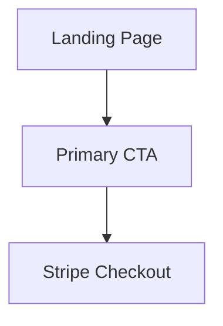
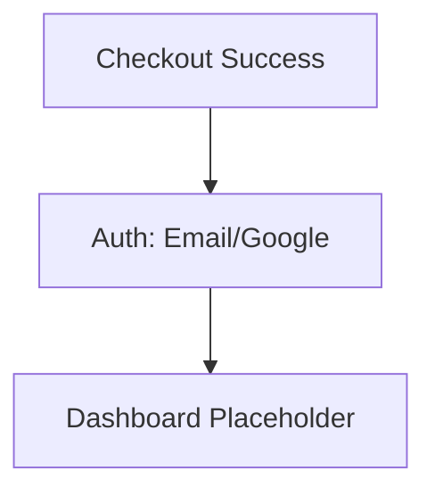
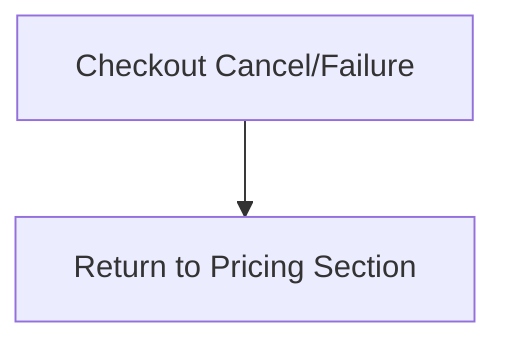
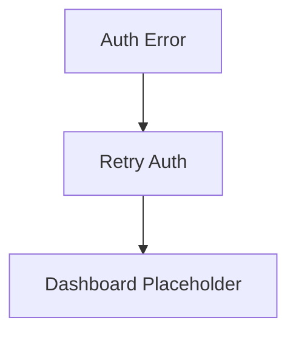

# {{project_name}} UX Design Specification

_Created on {{date}} by {{user_name}}_
_Generated using BMad Method - Create UX Design Workflow v1.0_

---

## Executive Summary

**Project:** autopilotreels — a payment-first demand-validation MVP for an AI short-form video SaaS idea. The MVP focuses on a pixel-close, trust-building landing experience that drives users directly into Stripe checkout before signup, followed by post-payment auth and a placeholder dashboard. The goal is to validate conversion, pricing, and willingness to pay without building AI video capabilities.

**Target Users:** Prospective buyers interested in AI short-form video automation (likely creators, marketers, or small teams), visiting from paid/organic traffic who should feel immediate trust and be willing to pay before account creation. The experience prioritizes frictionless checkout and clear expectations about limited availability.

**Platform:** Web (responsive).

**UX Complexity:** Low (single primary user journey, simple linear funnel, and minimal interaction depth).

**Reference Clone Target:** facelessreels.com (pixel-close structure, hierarchy, and visual rhythm).

**Inspiration Analysis (Reference: facelessreels.com):**

- Above-the-fold hero with a bold outcome headline (“Create viral faceless videos on auto‑pilot”), a clear primary CTA (“Create your first video”), and a large “Trusted by 353k+ users” credibility marker.
- Subheadline promise: “The only AI that generates & posts videos for you automatically, even while you sleep.”
- Immediate sub‑CTA promise: “Get your generated video in less than 5 minutes.”
- “Perfect for” / niche list that scrolls through categories (e.g., scary stories, history, true crime) to quickly show breadth.
- “Creates videos for any niche” grid that repeats the breadth message in a structured list.
- “We actually get views” proof section with channel performance screenshots and metrics.
- “Why creators choose us” comparison block (hiring editors vs DIY vs FacelessReels).
- Large testimonial grid with repeated short quotes to reinforce social proof.
- “How it works” in 3 steps (Create a Series → Customize → Watch your socials grow).
- “See it in action” demo video section.
- FAQ section covering common objections.
- Simple top navigation and straightforward footer with product/company/legal links.

---

## 1. Design System Foundation

### 1.1 Design System Choice

**Choice:** shadcn/ui + Radix UI primitives.

**Rationale:** Best fit for pixel‑close cloning. shadcn provides flexible, composable components with full visual control, while Radix supplies accessible interaction primitives (focus management, ARIA, keyboard behavior) without forcing a visual style.

**Provides:** Buttons, inputs, modals/dialogs, menus, tabs, accordions, tooltips, toasts, and form patterns as unstyled primitives and Tailwind‑friendly components.

**Customization Needs:** Full theming (colors, typography, spacing) to match the reference site, plus marketing‑specific sections (hero, proof, comparison, testimonials) built as custom layout components.

---

## 2. Core User Experience

### 2.1 Defining Experience

**Defining Experience:** A pixel‑close web landing page that mirrors the reference site’s structure and visual rhythm to build immediate trust, then drives users straight into a payment‑first Stripe checkout before any account creation.

**One‑Sentence Definition:** “It’s the pixel‑perfect landing page clone that builds instant trust and gets you to a payment‑first checkout in seconds.”

**Absolutely Effortless:** Scrolling the landing page, understanding value fast, and clicking the primary CTA into checkout with zero friction or pre‑signup.

**Most Critical Action:** Completing Stripe checkout (payment before signup), then seamlessly transitioning into post‑payment auth.

**Platform:** Web (responsive).

### 2.2 Novel UX Patterns

**Emotional Response:** Mirror the reference site’s emotional impact — trustworthy, premium, and conversion‑focused, with a polished SaaS aesthetic that makes payment‑first checkout feel normal and safe.

**Notes:** Since we’re cloning the reference UX, we’ll align emotional cues (visual hierarchy, spacing, tone, and CTA treatment) to match the reference experience as closely as possible.

**Core Experience Principles:**

- **Speed:** Instant and frictionless — CTA → checkout should feel immediate, with no intermediate steps or distracting transitions.
- **Guidance:** Minimal — the page should be self‑explanatory via layout hierarchy and CTA prominence.
- **Flexibility:** Low — a single, linear conversion path is preferred over multiple options.
- **Feedback:** Subtle confidence signals — trust badges, proof, and clear states without celebratory noise.

---

## 3. Visual Foundation

### 3.1 Color System

**Theme Direction:** Reference clone (approximate palette based on facelessreels.com).

**Color Palette (Approx):**

- Primary / CTA: `#111827`
- Primary Text: `#0B0B0F`
- Secondary Text: `#6B7280`
- Background: `#F9FAFB`
- Surface/Card: `#FFFFFF`
- Border/Divider: `#E5E7EB`
- Accent/Link: `#3B82F6`
- Success: `#22C55E`
- Warning: `#F59E0B`
- Error: `#EF4444`
- Info: `#0EA5E9`

**Usage Notes:**

- Keep CTA treatment bold and minimal to mirror reference hierarchy.
- Use neutral surfaces with subtle borders; avoid heavy shadows.
- Reserve accent color for links and small highlights; keep primary CTA monochrome.

**Theme Tokens (CSS Variables):**

```css
:root {
  --color-bg: #F9FAFB;
  --color-surface: #FFFFFF;
  --color-text: #0B0B0F;
  --color-text-muted: #6B7280;
  --color-border: #E5E7EB;
  --color-primary: #111827;
  --color-primary-contrast: #FFFFFF;
  --color-accent: #3B82F6;
  --color-success: #22C55E;
  --color-warning: #F59E0B;
  --color-error: #EF4444;
  --color-info: #0EA5E9;
}
```

**Interactive Visualizations:**

- Color Theme Explorer: [ux-color-themes.html](./ux-color-themes.html)

---

## 4. Design Direction

### 4.1 Chosen Design Approach

**Chosen Direction:** Clone + Slight Polish.

**Definition:** Preserve the exact section order, hierarchy, and overall layout from facelessreels.com, while applying subtle refinements for spacing consistency, typography rhythm, and alignment precision. No structural changes; only micro‑adjustments that improve visual crispness.

**Rationale:** Maintains the conversion‑proven layout while improving perceived quality and consistency, without altering user expectations or flow.

**Key Polishes:**
- Standardize vertical spacing between sections.
- Align CTA sizes and text rhythm across hero/pricing blocks.
- Ensure consistent card padding and grid gutters.
- Refine heading scale for clearer hierarchy without changing copy or layout order.

**Interactive Mockups:**

- Design Direction Showcase: [ux-design-directions.html](./ux-design-directions.html)

---

## 5. User Journey Flows

### 5.1 Critical User Paths

**Journey 1: Landing → CTA → Stripe Checkout**

User Goal: Start payment with minimal friction.
Approach: Linear, single‑direction flow with CTA prominence.

Flow Steps:
1. Landing page
   - User sees: Hero + proof + pricing sections in familiar order
   - User does: Click primary CTA
   - System responds: Redirects to Stripe checkout

Success State:
- Stripe checkout loads quickly with plan pre‑selected.

Mermaid:


**Journey 2: Checkout Success → Auth → Dashboard**

User Goal: Complete signup and access purchased experience.
Approach: Payment‑first, then auth with minimal steps.

Flow Steps:
1. Checkout Success
   - User sees: Confirmation + “Continue to set up your account”
   - User does: Click continue
   - System responds: Redirects to auth

2. Auth
   - User sees: Email + Google OAuth options
   - User does: Sign up or log in
   - System responds: Links payment → user account

3. Dashboard
   - User sees: “High demand / limited availability” message + account info
   - User does: Review status
   - System responds: Confirms access

Mermaid:


**Journey 3: Checkout Cancel/Failure → Return to Pricing**

User Goal: Recover and try again.
Approach: Clear messaging + quick path back to CTA.

Flow Steps:
1. Checkout Cancel/Failure
   - User sees: Reason + “Return to pricing”
   - User does: Click return
   - System responds: Returns to pricing section

Mermaid:


**Journey 4: Auth Failure/Retry → Dashboard**

User Goal: Complete auth without drop‑off.
Approach: Simple error messaging and retry.

Flow Steps:
1. Auth Error
   - User sees: Clear error + retry option
   - User does: Retry or switch method
   - System responds: Auth success and redirect

Mermaid:


---

## 6. Component Library

### 6.1 Component Strategy

**Design System Components (shadcn/ui + Radix):**
- Buttons, inputs, tabs/accordion (FAQ), dialog/modal, toast, card, dropdown/menu

**Custom Components Needed (for clone fidelity):**
- **Niche Carousel** (scrolling “Perfect for” niches)
- **Proof Metrics Strip** (channel performance screenshots + metrics)
- **Testimonial Grid** (dense trust blocks with repeated short quotes)

**Components Requiring Heavy Customization:**
- **Hero CTA Block** (exact typography/spacing/CTA alignment)
- **Comparison Table** (“Why creators choose us” layout)

**Custom Component Specs (abbrev):**

1) **Niche Carousel**
   - Purpose: Rapidly communicates breadth of supported niches.
   - Anatomy: Title, horizontally scrolling tag list, subtle fade mask, pause on hover.
   - States: Default / hover (pause) / reduced‑motion (static list).
   - Accessibility: ARIA role=region, keyboard horizontal scroll.

2) **Proof Metrics Strip**
   - Purpose: Reinforce credibility with real performance proof.
   - Anatomy: Screenshot image, metrics caption, channel label.
   - States: Default / responsive collapse (stacked on mobile).
   - Accessibility: Alt text for screenshots, caption text.

3) **Testimonial Grid**
   - Purpose: Dense social proof at scale.
   - Anatomy: Card grid, quote text, name handle (optional).
   - States: Default / responsive (2‑col → 1‑col).
   - Accessibility: Semantic blockquote structure.

---

## 7. UX Pattern Decisions

### 7.1 Consistency Rules

**Button Hierarchy**
- Primary: Solid dark CTA, used only for conversion actions (hero + pricing).
- Secondary: Ghost/outline for auxiliary actions (demo).
- Tertiary: Text link for navigation/footers.
- Destructive: Minimal, used only in auth/account areas (not landing).

**Feedback Patterns**
- Success: Inline confirmation + subtle toast.
- Error: Inline message near field + optional toast.
- Warning: Inline alert in checkout/auth states.
- Loading: Spinner only on checkout redirect or auth.

**Form Patterns**
- Labels above inputs.
- Required indicator via “*”.
- Validation on blur + on submit.
- Errors inline under field.
- Help text as caption below label.

**Modal Patterns**
- Size: Small for confirmation, medium for auth prompts.
- Dismiss: Escape + close icon, no click‑outside on critical flows.
- Focus: Auto‑focus first field; return focus to trigger.
- Stacking: Avoid multiple modals.

**Navigation Patterns**
- Active state: Bold text + subtle underline.
- Breadcrumbs: Not used in marketing flow.
- Back behavior: Browser back supported; no custom override.
- Deep links: Anchor links to sections (pricing, FAQ).

**Empty States**
- Dashboard: “High demand / limited availability” with support link.
- No results: Not applicable (marketing flow).

**Confirmation Patterns**
- Delete: Not applicable in MVP.
- Leave unsaved: Not applicable.
- Irreversible actions: Stripe handles confirmation.

**Notifications**
- Placement: Top right toast (if used).
- Duration: Auto‑dismiss after 4–6s.
- Stacking: Max 2 visible.
- Priority: Only errors/success, avoid info noise.

**Search**
- Not used in MVP.

**Date/Time**
- Not used in MVP.

---

## 8. Responsive Design & Accessibility

### 8.1 Responsive Strategy

**Breakpoints:**
- Mobile: ≤ 640px (1‑column, stacked sections, full‑width CTA)
- Tablet: 641–1024px (2‑column where applicable)
- Desktop: ≥ 1025px (full grid layout)

**Adaptation Patterns:**
- Navigation: Collapses to minimal top nav with anchor links.
- Hero: CTA stack on mobile; aligned row on desktop.
- Cards/Lists: Grid → single column.
- Tables/Comparisons: Stack into cards on mobile.
- Modals: Full‑screen on mobile, centered on desktop.
- Forms: Single column on mobile.

**Accessibility Strategy (WCAG 2.1 AA):**
- Color contrast: 4.5:1 for body text, 3:1 for large text.
- Keyboard navigation: All interactive elements reachable.
- Focus indicators: Visible for all focusable elements.
- ARIA labels: Meaningful for buttons/inputs.
- Alt text: Required for proof screenshots and icons.
- Form labels: Always associated.
- Error identification: Clear, specific messages.
- Touch targets: ≥ 44px.

**Testing:**
- Automated: Lighthouse, axe DevTools.
- Manual: Keyboard‑only navigation and screen reader checks (VoiceOver/NVDA).

---

## 9. Implementation Guidance

### 9.1 Completion Summary

Excellent work! Your UX Design Specification is complete.

**What we created together:**

- **Design System:** shadcn/ui + Radix with 3 custom components
- **Visual Foundation:** Approximate reference palette with CSS tokens
- **Design Direction:** Clone + Slight Polish (pixel‑close structure, refined spacing/typography)
- **User Journeys:** 4 core flows covering checkout → auth → dashboard
- **UX Patterns:** Consistent button, form, feedback, and navigation rules
- **Responsive Strategy:** 3 breakpoints with mobile‑first adaptations
- **Accessibility:** WCAG 2.1 AA target

**Your Deliverables:**
- UX Design Document: `docs/ux-design-specification.md`
- Interactive Color Themes: `docs/ux-color-themes.html`
- Design Direction Mockups: `docs/ux-design-directions.html`

**What happens next:**
- Designers can produce high‑fidelity screens from the clone blueprint
- Developers can implement with clear, consistent UX rules
- All decisions are documented with rationale for fast iteration

---

## Appendix

### Related Documents

- Product Requirements: `{{prd_file}}`
- Product Brief: `{{brief_file}}`
- Brainstorming: `{{brainstorm_file}}`

### Core Interactive Deliverables

This UX Design Specification was created through visual collaboration:

- **Color Theme Visualizer**: {{color_themes_html}}
  - Interactive HTML showing all color theme options explored
  - Live UI component examples in each theme
  - Side-by-side comparison and semantic color usage

- **Design Direction Mockups**: {{design_directions_html}}
  - Interactive HTML with 6-8 complete design approaches
  - Full-screen mockups of key screens
  - Design philosophy and rationale for each direction

### Optional Enhancement Deliverables

Additional HTML artifacts generated:

- **Key Screens Showcase**: `docs/ux-key-screens.html`
- **User Journey Visualization** (all four flows): `docs/ux-journeys.html`

<!-- Additional deliverables added here by other workflows -->

### Next Steps & Follow-Up Workflows

This UX Design Specification can serve as input to:

- **Wireframe Generation Workflow** - Create detailed wireframes from user flows
- **Figma Design Workflow** - Generate Figma files via MCP integration
- **Interactive Prototype Workflow** - Build clickable HTML prototypes
- **Component Showcase Workflow** - Create interactive component library
- **AI Frontend Prompt Workflow** - Generate prompts for v0, Lovable, Bolt, etc.
- **Solution Architecture Workflow** - Define technical architecture with UX context

### Version History

| Date     | Version | Changes                         | Author        |
| -------- | ------- | ------------------------------- | ------------- |
| {{date}} | 1.0     | Initial UX Design Specification | {{user_name}} |

---

_This UX Design Specification was created through collaborative design facilitation, not template generation. All decisions were made with user input and are documented with rationale._
